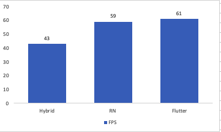
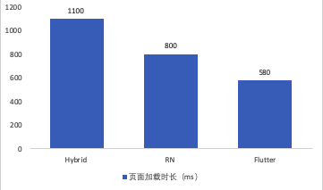
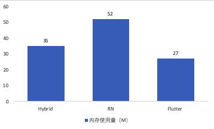
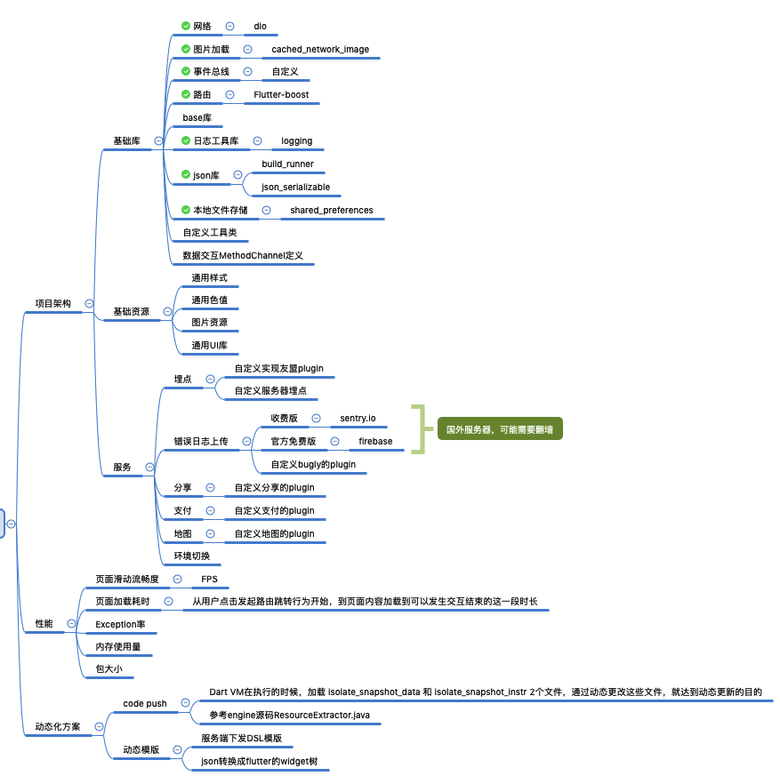

## 跨平台技术架构实践

### 一、为什么需要跨平台技术

本质上，跨平台开发是为了增加代码复用，减少开发者对多个平台差异适配的工作量，降低开发成本，提高业务专注度。

### 二、Hybrid、RN、Flutter对比

#### 2.1 简单对比

|      类型      |    Hybrid    |      React Native       |              Flutter               |
| :------------: | :----------: | :---------------------: | :--------------------------------: |
|      语言      |  javaScript  |       javaScript        |                Dart                |
|      环境      |   WebView    |       JSCore引擎        |           Flutter Engine           |
|    发布时间    |     2011     |          2015           |                2018                |
| 空项目打包大小 | 基本不占空间 | Android 18.8M/ IOS 1.6M | Android 32位5.4M 64位5.7M/ IOS 13M |
|    代码产物    |      h5      |      JS Bundle文件      |               二进制               |

#### 2.2 开发效率

Hybrid、RN、Flutter都是一套代码多端运行的，相对于Native开发更加高效。

Hybrid和RN都是使用javascript开发，对移动端的同学来说有一定的学习成本

Flutter：使用dart语言开发，对整个大前端都有一定的学习成本

三者同等熟悉程度来说，开发效率相差不大；但RN的文档不是很健全，官网上只简单介绍了用法和各个控件的属性，对细节描述很少。

#### 2.3 多端一致性

Hybrid由于是WebView渲染，多端显示基本是一致的；

RN两个平台的控价还未完全统一，很多空间都是iOS专属或者Android专属，还有部分同一控件在不同平台上表现差异也很大；

Flutter属于自渲染框架，界面渲染不依赖于平台，多端显示都是一致的。

#### 2.4 性能体验

Hybrid：由于资源都存储在服务器上，所以对于网速有很大的依赖，然后还要通过WebView来渲染显示；

RN：使用过程中会将js转换成原生控件，然后再由原生渲染显示；

Flutter：自渲染引擎，不依赖于原生渲染，在中高端机型中，Flutter和Native不相上下，在低端机型上，Flutter比Native更加流畅

#### 2.5 动态化

Hybrid：H5随时上线即可

RN：通过code push推送最新代码到客户端

Flutter：目前官方并未提供动态化方案，但第三方已经有动态化思路，主流方案有：1.修改engine源码；2.动态模版，通过服务器下发DSL模版，然后转换成widget树，实现渲染。

### 三、性能测试结果

> H5、RN、Flutter都实现了教练端签到列表页面，以此页面为例，从页面滑动流畅度、页面加载耗时、内存使用量三个方面测试，测试机为：Android 小米2s mix、iOS iPhone X

#### 3.1 页面流畅度--FPS

#### 3.2 页面加载耗时

#### 3.3 内存使用量

### 四、Flutter 项目架构实践

