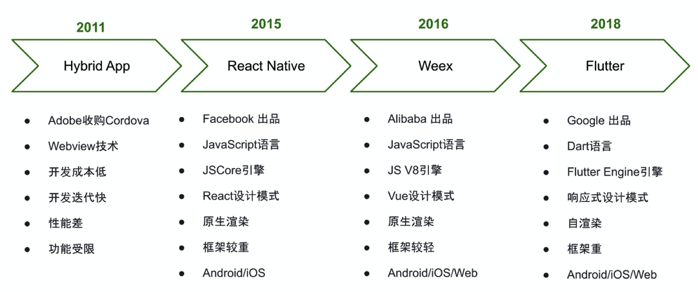

## Flutter跨平台技术架构实践

### 一、Flutter简介

Flutter是Google在2015年推出的移动UI框架，可快速在iOS和Android上构建高质量的原生用户界面。初始名字叫做“Sky”，后更名为Flutter，并在2018年的Google大会上正式发布第一个Beta版本。

目标是创建高性能、高稳定性、高帧率、低延迟的Android和iOS应用，且体验和Native应用一致。

Google新一代操作系统Fuchsia的UI开发框架，Fuchsia于2018年4月13日发布了官方文档。

### 二、跨平台技术对比

2.1 简单对比

|      类型      |    Hybrid    |      React Native       |              Flutter               |
| :------------: | :----------: | :---------------------: | :--------------------------------: |
|      语言      |  javaScript  |       javaScript        |                Dart                |
|      环境      |   WebView    |       JSCore引擎        |           Flutter Engine           |
|    发布时间    |     2011     |          2015           |                2018                |
| 空项目打包大小 | 基本不占空间 | Android 18.8M/ IOS 1.6M | Android 32位5.4M 64位5.7M/ IOS 13M |
|    代码产物    |      h5      |      JS Bundle文件      |               二进制               |

2.2 跨平台技术发展历程

### 三、Flutter基础原理

### 四、Flutter构建原理

### 五、Flutter和Native混合开发

### 六、未来展望